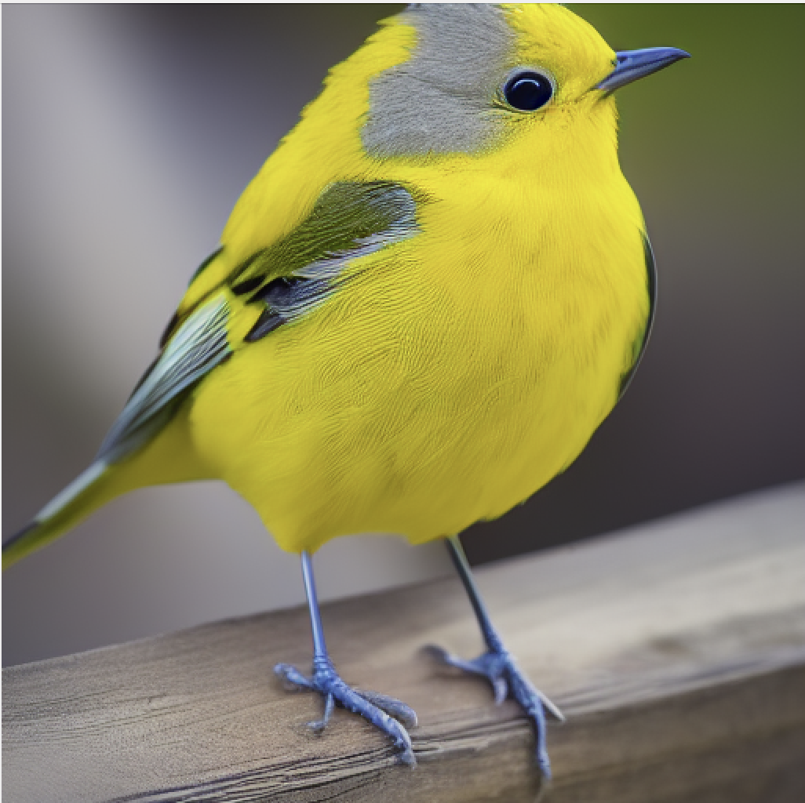
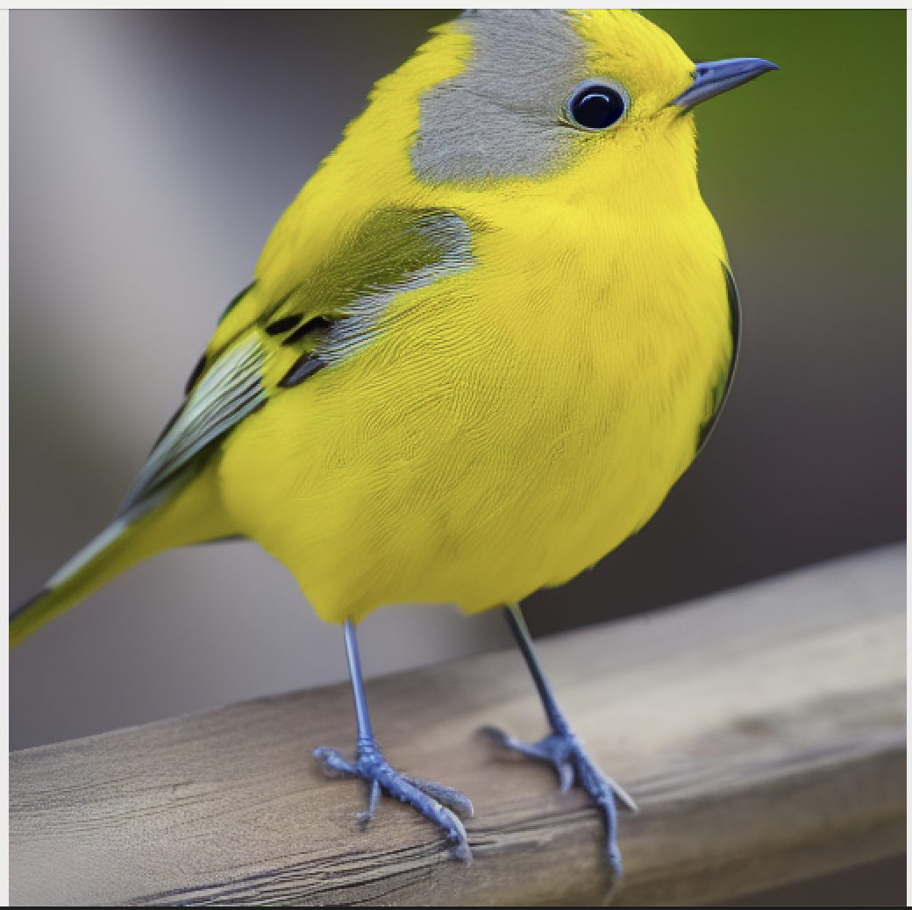

# controlnet_stable_tensorrt
本项目实现用tensorrt加速有controlnet的stable diffusion，基于文生图进行演示

由于nvidia官方只有stable diffusion的demo，并没有加入controlnet,但是很多道友却需要controlnet，因此特来渡下有缘人。同时本项目也有不完善的地方，错误之处，望请海涵。

## 依赖库

本项目基于sd1.5开发，采用的opset为17（经测试，sd2.1也同样可以）

目前我测试的主要环境如下，更多细节，请参考：[tensorrt](https://github.com/NVIDIA/TensorRT/tree/release/8.6/demo/Diffusion)

```
cuda-python              12.1.0rc1+1.g9e30ea2.dirty
huggingface-hub          0.13.4
nvidia-cublas-cu12       12.1.0.26
nvidia-cuda-runtime-cu12 12.1.55
nvidia-cudnn-cu12        8.8.1.3
nvidia-dali-cuda110      1.22.0
nvidia-pyindex           1.0.9
onnx                     1.13.1
onnx-graphsurgeon        0.3.26
onnxruntime              1.14.1
protobuf                 3.20.3
tensorrt                 8.6.0
torch                    1.13.1+cu117
triton                   2.0.0
```

## 运行

```bash
python3 demo_txt2img_db.py  --hf-token="your huggingface token" -v
```

*Note:Build engine的过程异常漫长，大约30-40分钟，请耐心等待*

## 结果

对比了用tensorrt与不用的效果，基本上没有差异(左图为tensorrt优化后的)，效率提升大约30-40%左右（baseline采用fp16），在rtx8000上处理一张512的图片花费时间约1200ms



## 不足

- 目前生成一张512x512的图片需要花费显存约30G左右，由于此项目基于tensorrt官方代码开发，因此，bug fix进度依赖官方，请酌情考虑
- 目前图片写定了512x512，后续有时间优化成其它尺度

## 感谢

本项目参考了[tensorrt](https://github.com/NVIDIA/TensorRT/tree/release/8.6/demo/Diffusion)以及[paddle](https://github.com/PaddlePaddle/PaddleNLP/tree/develop/ppdiffusers/deploy)，感谢开源的力量

